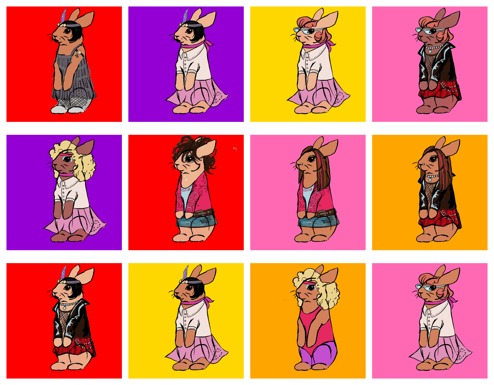

# 🐰 Bunnies Through The Decades

Welcome to our NFT project — **Bunnies Through The Decades**!  

A generative art NFT project showcasing bunnies styled from the 1920s to the 2000s! This project uses Python and Jupyter Notebook to programmatically generate a unique NFT collection based on layered traits.

---

## 📦 Project Overview

This repository contains the code used to:
- Custom Python classes to generate NFTs from traits and metadata
- A solid color generator for backgrounds
- Rarity-based sorting
- Grid preview rendering
- Export to PNG format

---

## 🎨 Collection Traits

Our NFTs are created using 5 unique layers:

- **Background** 
- **Character Fur** 
- **Outfit** 
- **Hair** 
- **Linework**

Each trait has a rarity score that affects how often it appears in the collection.

---

## 🧠 Technologies Used

- Python 
- Jupyter Notebook 
- NumPy / Pandas
- Pillow (PIL)
- Matplotlib

---

## 🖼️ NFT Collection Preview

Here’s a sample preview of our generated NFTs:



---

## 🛠️ How to Run

1. Clone this repository
   ```bash
   git clone https://github.com/Maheen012/Bunniverse-NFT.git
   cd Bunniverse-NFT
   ```
2. Open the Jupyter Notebook and run the cells to generate our collection.
   
### 📂 Alternatively

You can view our pre-generated NFT images by navigating to:
```bash
generated assets/
```

---

## 👥 Group Members

- Maheen Mohammad Alim
- Heather Meatherall
- Mehrin Hossain
- Mila Launen
